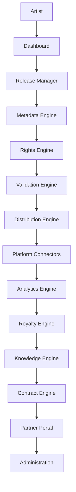

# BES Universal Music Distribution Platform Architecture

## Purpose

This specification extends BES (Bot Evolution System) with an enterprise-grade Universal Music Distribution Platform that manages the full lifecycle of a digital music release, from artist onboarding through royalties, analytics, contracts, partner management, and administration.

## Knowledge OS Philosophy

BES is a Knowledge OS: it must design, operate, document, and improve itself from project memory instead of forcing users to manage technical structure manually. Users describe intentions and business goals; the platform is responsible for discovering existing assets, choosing technical structures, maintaining data models, documents, hooks, background jobs, knowledge graphs, registries, tests, migrations, indexes, links, architecture changes, and accumulated learning.

Before creating any new object, BES must discover and reuse existing knowledge wherever possible. Every new fact, API, workflow, tool, hook, job, model, document, rule, permission, and UI surface must be integrated into the unified project knowledge space with provenance, relationships, and retrieval metadata.

### Persistent Project Memory

Agents must not rely on guesswork when project knowledge already exists. For every task, the responsible agent must inspect the relevant scope of the codebase, project history, documents, hooks, tools, APIs, pages, workflows, registries, and knowledge records before deciding that something is missing. Discovery results must be saved back into persistent memory so the same capability is not rediscovered from scratch in future tasks.

### Never Duplicate Rule

If an object already exists, BES must update, extend, or refactor it instead of creating a competing object. Names such as `release2`, `release_final`, `release_new`, `release_copy`, and `release_v4` are anti-patterns. The correct flow is to find the canonical object, read it, identify the right insertion point, merge the change, update backlinks, update indexes, and update the knowledge graph.

### Self-Growing Knowledge

Every useful discovery becomes durable knowledge. When an agent first learns that a capability such as `scheduleJobAt` exists, it must register the capability, examples, constraints, source references, and known usage patterns so later agents can retrieve that answer directly instead of repeating the investigation.

### Runtime Documentation

Documentation is generated and verified from runtime knowledge, not maintained as a disconnected artifact. Creating or changing a tool, API, workflow, event, storage object, permission, or connector must trigger documentation updates, examples, schema/type updates, dependency maps, tests, and registry entries.

### Semantic Workspace

BES should hide implementation workspace mechanics from the user. A request such as "build a release publication system" should cause BES to derive the required domain, knowledge records, agents, hooks, events, storage, views, jobs, APIs, indexes, and permissions without exposing that internal scaffolding unless review is needed.

### Auto Knowledge Builder

Every code-writing workflow must update the unified knowledge space. Creating an API must update the API registry, generated documentation, tests, types, dependency map, and knowledge graph. Creating a worker must update event contracts, queue policy, observability metadata, retry policy, and operational runbooks.

### Knowledge Graph First

The authoritative project model is a graph rather than a folder tree. BES must represent typed relationships such as `Artist creates Release`, `Release uses Distribution`, `Distribution uses DSP`, and `DSP has Audience`, and it must keep those relationships synchronized with code, documents, storage, permissions, and workflows.

### Universal Registry

BES must automatically register APIs, tools, workflows, agents, prompts, hooks, jobs, tables, caches, permissions, UI pages, documents, knowledge records, rules, and models. Registry records must include owner, purpose, lifecycle state, dependencies, examples, tests, provenance, and links into the knowledge graph.

### Auto Refactoring

BES should continuously inspect project knowledge and implementation artifacts for duplicate code, dead code, stale knowledge, unused documents, repeated hooks, conflicting rules, and orphaned registry records. Safe changes may be proposed or automated according to risk policy; destructive changes require auditability and, where appropriate, human approval.

### Evolution Engine and Meta Memory

Each agent should follow an improvement loop: Observation, Memory, Hypothesis, Simulation, Decision, Execution, Learning, Optimization, and Memory. BES must also maintain meta-memory about agent behavior: repeated mistakes, successful decisions, ineffective tools, effective prompts, failure causes, and remediation patterns. This meta-memory must influence future planning and quality gates.

### Self-Generated Knowledge Base

Users should not have to create docs, knowledge folders, hooks, registries, wiki pages, notes, FAQs, changelogs, or migration guides by hand. When BES creates a meaningful artifact, it must determine the required knowledge-base updates and generate descriptions, examples, tests, dependency maps, FAQs, changelog entries, and migration guidance automatically.

### Knowledge Merge

Documentation and knowledge changes must be merged into canonical records. If `Music.md` already exists, BES must not create `Music2.md` or `Music_new.md`; it must read `Music.md`, analyze the existing structure, update the correct section, refresh links, update indexes, and update graph relationships.

### Chatium Capability Discovery Rule

Before concluding that a Chatium function, package, runtime module, or typing is unavailable, an agent must check official Chatium documentation, runtime typings and available modules, existing project usage, and the internal project knowledge registry. If later evidence proves the capability exists, BES must update the knowledge base so future agents do not repeat the same mistake.

## Target Value Stream

## Core Domains

| Domain              | Responsibility                                                                                      | Primary Outputs                                              |
| ------------------- | --------------------------------------------------------------------------------------------------- | ------------------------------------------------------------ |
| Release Manager     | Release lifecycle, status orchestration, asset grouping, approvals                                  | Release records, lifecycle events, submission packages       |
| Metadata Manager    | Track, album, contributor, territory, language, explicit-content, and genre metadata                | Normalized metadata DTOs, DDEX-ready metadata                |
| Audio Validator     | Audio format, loudness, duration, codec, bitrate, duplication, silence, and corruption checks       | Audio validation report, remediation tasks                   |
| Artwork Validator   | Cover-art dimensions, color mode, forbidden content, text consistency, and platform policy checks   | Artwork validation report, policy exceptions                 |
| Rights Manager      | Ownership, licensing, territory restrictions, contributor shares, conflicts, takedowns              | Rights graph, clearance decisions, conflict alerts           |
| Distribution Engine | Delivery orchestration, packaging, retries, platform-specific submission state                      | Distribution jobs, delivery receipts, error recovery actions |
| Platform Connectors | API, SDK, DDEX, feed, SFTP, OAuth, and custom partner integrations                                  | Connector adapters, auth profiles, platform receipts         |
| Analytics Engine    | Streams, revenue, country, audience, growth, forecasting, recommendations                           | Analytics facts, dashboards, recommendations                 |
| Royalty Engine      | Royalty splits, statements, revenue share, commission, subscription, white-label, and hybrid models | Statements, payout calculations, audit trails                |
| Knowledge Engine    | Document ingestion, semantic extraction, graph updates, vector indexing, architecture suggestions   | BES records, graph edges, implementation tasks               |
| Contract Engine     | Contract analysis, legal-risk comparison, draft generation, appendices, commercial offers           | Contract drafts, risk checklists, human approval gates       |
| Partner Portal      | Partner onboarding, requirements exchange, documents, integration status                            | Partner profiles, requirement matrices, approvals            |
| Administration      | Roles, permissions, audit, settings, compliance, incident controls                                  | Admin policies, audit exports, security events               |

## Knowledge Processing Pipeline

Every incoming source is processed by the same controlled pipeline:

1. `RawDocumentReceived` stores source provenance, license, checksum, owner, confidentiality, and retention policy.
2. `DocumentParsed` extracts text, tables, diagrams, schemas, endpoint descriptions, and attachments.
3. `DocumentChunked` creates traceable chunks with stable IDs, offsets, headings, and source citations.
4. `SemanticAnalysisCompleted` identifies intent, domain, obligations, rules, and implementation impact.
5. `EntitiesExtracted` captures modules, services, endpoints, authentication, permissions, requirements, business rules, errors, rate limits, contracts, financial models, workflows, integrations, and dependencies.
6. `RelationshipsDetected` connects entities using typed edges such as `requires`, `implements`, `conflicts_with`, `supersedes`, `depends_on`, and `governed_by`.
7. `KnowledgeGraphUpdated` persists nodes and edges with confidence scores and provenance.
8. `VectorIndexUpdated` indexes chunks and generated summaries for semantic retrieval.
9. `BESKnowledgeRegistryUpdated` publishes canonical records, extracted requirements, and open questions.
10. `ArchitectureSuggestionsGenerated` compares the new knowledge against the current architecture and detects missing components.
11. `ImplementationTasksCreated` creates backlog items, acceptance criteria, dependencies, and risk notes.

## Supported Input Types

The ingestion layer must support PDF, DOCX, Markdown, Swagger, OpenAPI, DDEX, XML, JSON, CSV, YAML, SDK repositories, GitHub repositories, REST API documentation, GraphQL schemas, HTML, wiki pages, legal agreements, partner requirements, and technical documentation.

## New Information Handling

When a parser or agent detects information not already represented in BES, the system must create a BES knowledge record, connect it to existing entities, generate a specification draft, suggest a module or connector if needed, update the knowledge graph, update documentation, and notify the architecture layer.

## Platform Discovery

For each platform, the Platform Discovery Agent must discover and normalize developer portal URLs, API references, SDKs, authentication methods, OAuth scopes, DDEX support, content feed formats, documentation, submission process, partner programs, enterprise programs, content policies, financial model, technical restrictions, and legal requirements.

## Connector Generation

When a new platform is approved for implementation, BES generates a connector package with DTOs, models, routes, services, tests, documentation, credentials policy, retry policy, rate-limit policy, observability events, and manual approval checkpoints for external submissions.

## Required API Routes

| Route               | Capability                                                                                             |
| ------------------- | ------------------------------------------------------------------------------------------------------ |
| `/api/distribution` | Create and monitor delivery jobs, retries, receipts, and takedowns.                                    |
| `/api/releases`     | Manage releases, tracks, lifecycle state, approvals, and audit events.                                 |
| `/api/platforms`    | Register platforms, requirements, authentication profiles, and connector status.                       |
| `/api/analytics`    | Query streams, revenue, audience, growth, forecasts, and AI recommendations.                           |
| `/api/contracts`    | Analyze partner terms, generate drafts, manage human review checklists.                                |
| `/api/royalties`    | Configure splits, calculate statements, export payout and audit data.                                  |
| `/api/connectors`   | Generate, configure, test, and monitor platform connectors.                                            |
| `/api/metadata`     | Normalize, validate, enrich, and transform release metadata.                                           |
| `/api/rights`       | Manage ownership, licensing, territories, conflicts, and clearances.                                   |
| `/api/finance`      | Model subscription, commission, revenue-share, enterprise, marketplace, custom, and hybrid agreements. |
| `/api/partners`     | Manage partner onboarding, requirements, contacts, documents, and integration status.                  |
| `/api/knowledge`    | Ingest documents, retrieve knowledge records, update graph edges, and create architecture suggestions. |
| `/api/publishing`   | Publish release posts to Telegram and other social destinations with retries, logs, and previews.      |

## Data Model Skeleton

| Entity                   | Key Fields                                                                                               |
| ------------------------ | -------------------------------------------------------------------------------------------------------- |
| `Artist`                 | `id`, `legalName`, `displayName`, `country`, `taxProfileId`, `verificationStatus`                        |
| `Release`                | `id`, `artistId`, `title`, `version`, `upc`, `status`, `releaseDate`, `territories`, `approvalState`     |
| `Track`                  | `id`, `releaseId`, `title`, `isrc`, `audioAssetId`, `explicit`, `contributors`, `rightsId`               |
| `Asset`                  | `id`, `type`, `uri`, `checksum`, `technicalMetadata`, `validationStatus`                                 |
| `RightsClaim`            | `id`, `assetId`, `claimantId`, `territories`, `share`, `startDate`, `endDate`, `evidenceUri`             |
| `DistributionJob`        | `id`, `releaseId`, `platformId`, `status`, `attempts`, `lastError`, `receiptId`                          |
| `Platform`               | `id`, `name`, `developerPortal`, `authType`, `submissionModes`, `rateLimits`, `policies`                 |
| `Connector`              | `id`, `platformId`, `version`, `capabilities`, `healthStatus`, `credentialsRef`                          |
| `AnalyticsFact`          | `id`, `platformId`, `releaseId`, `trackId`, `metric`, `country`, `period`, `value`                       |
| `RoyaltyStatement`       | `id`, `period`, `payeeId`, `gross`, `deductions`, `net`, `currency`, `status`                            |
| `Contract`               | `id`, `partnerId`, `type`, `status`, `riskScore`, `approvalRequired`, `effectiveDate`                    |
| `KnowledgeRecord`        | `id`, `sourceId`, `entityType`, `canonicalName`, `summary`, `confidence`, `provenance`                   |
| `ArchitectureSuggestion` | `id`, `knowledgeRecordId`, `suggestedChange`, `impact`, `dependencies`, `status`                         |
| `ImplementationTask`     | `id`, `suggestionId`, `title`, `acceptanceCriteria`, `dependencies`, `priority`, `status`                |
| `PublicationAccount`     | `id`, `type`, `displayName`, `username`, `avatarUrl`, `favorite`, `lastUsedAt`, `permissionStatus`       |
| `PublicationJob`         | `id`, `releaseId`, `accountId`, `status`, `attempts`, `lastErrorCode`, `lastErrorMessage`, `nextRetryAt` |
| `PublishingSettings`     | `id`, `preset`, `toggles`, `layout`, `templateId`, `autosaveRevision`, `previewSnapshotId`               |

## Events and Workers

| Event                         | Worker                            | Responsibility                                                                                      |
| ----------------------------- | --------------------------------- | --------------------------------------------------------------------------------------------------- |
| `DocumentUploaded`            | `knowledge-ingestion-worker`      | Parse, chunk, classify, extract, and index documents.                                               |
| `NewKnowledgeDetected`        | `architecture-suggestion-worker`  | Generate specs, missing-module proposals, and implementation tasks.                                 |
| `ReleaseSubmitted`            | `release-orchestration-worker`    | Validate metadata, rights, audio, artwork, and approvals.                                           |
| `ValidationFailed`            | `remediation-worker`              | Create actionable remediation tasks for artists or administrators.                                  |
| `DistributionRequested`       | `distribution-worker`             | Package and submit approved releases through connectors.                                            |
| `ReleasePublicationRequested` | `publishing-worker`               | Generate a release post, send it to Telegram, retry temporary failures, and log user-facing errors. |
| `PublishingSettingsChanged`   | `settings-autosave-worker`        | Autosave instant panel changes and create undo/redo history entries.                                |
| `PlatformReceiptReceived`     | `connector-reconciliation-worker` | Reconcile external delivery state with internal jobs.                                               |
| `AnalyticsImported`           | `analytics-normalization-worker`  | Normalize platform metrics and update dashboards.                                                   |
| `RevenueImported`             | `royalty-calculation-worker`      | Calculate royalties and generate statements.                                                        |
| `ContractDraftRequested`      | `contract-drafting-worker`        | Generate contract draft and legal review checklist.                                                 |

## Human Approval Gates

BES must not submit documents to external organizations, accept legal obligations, execute contracts, change financial agreements, or submit live releases to platforms without explicit user approval. Generated drafts, offers, platform applications, and legal checklists remain internal until approved.

## Risk Controls

- Legal risk: external terms and generated drafts require human review before acceptance or dispatch.
- Financial risk: royalty calculations require auditable inputs, immutable calculation versions, and statement approvals.
- Compliance risk: source documents require provenance, retention, confidentiality labels, and access controls.
- Platform risk: connectors require sandbox testing, rate-limit enforcement, idempotency keys, and delivery receipt reconciliation.
- Data risk: artist tax data, contract data, credentials, and payout details require encryption, least privilege, and audit logging.

## Implementation Plan

1. Create the BES Knowledge Registry schema and document ingestion interfaces.
2. Implement parsers and chunkers for the supported document types, starting with Markdown, OpenAPI, JSON, XML, CSV, and PDF.
3. Add entity extraction and relationship detection services with provenance-aware confidence scores.
4. Implement the Release, Metadata, Rights, Validation, Distribution, Analytics, Royalty, Contract, Partner, and Administration domain services.
5. Add platform connector scaffolding and generation templates.
6. Add route controllers and DTOs for the required API surface.
7. Add workers, events, queues, retry policies, and observability dashboards.
8. Add human approval workflows for legal, financial, external-submission, and live-distribution actions.
9. Add automated documentation generation from knowledge records, connectors, and OpenAPI definitions.
10. Add acceptance tests for ingestion, release submission, connector generation, royalty calculations, publication retries, Telegram error handling, autosave, and contract approval gates.
11. Implement the fast publication settings panel described in [Release Publishing and Fast Settings UX](./release-publishing-ux.md).

## Task Queue Seed

| Priority | Task                                                                                                                                                   | Dependency                |
| -------- | ------------------------------------------------------------------------------------------------------------------------------------------------------ | ------------------------- |
| P0       | Define `KnowledgeRecord`, `ArchitectureSuggestion`, and `ImplementationTask` persistence schemas.                                                      | None                      |
| P0       | Define human approval gate service and audit event model.                                                                                              | None                      |
| P1       | Implement document ingestion API and parser interfaces.                                                                                                | Knowledge schema          |
| P1       | Implement release lifecycle API and validation orchestration.                                                                                          | Approval gate service     |
| P1       | Implement platform registry and connector manifest schema.                                                                                             | Knowledge schema          |
| P2       | Implement contract-risk comparison service and draft-generation workflow.                                                                              | Approval gate service     |
| P2       | Implement royalty calculation models for subscription, commission, revenue share, enterprise, white label, marketplace, custom, and hybrid agreements. | Finance schema            |
| P2       | Implement analytics normalization and forecast pipelines.                                                                                              | Platform registry         |
| P3       | Generate first connector from discovered platform requirements.                                                                                        | Connector manifest schema |
